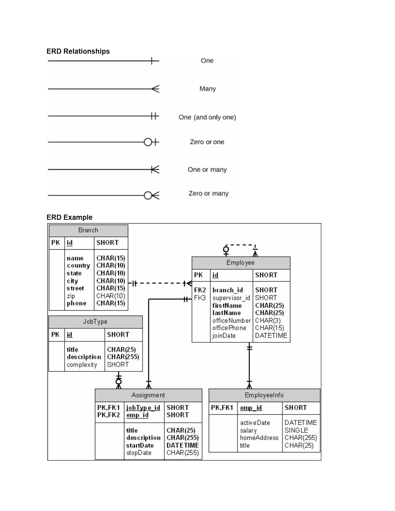

## Entity Reference Diagrams

#### Objectives

* Draw entity relationship diagrams with crow's foot notation for ideas for Android apps
* Describe how tables relate to each other using foreign keys
* Explain the different relationship types – 1:1, 1:many, many:many

#### ERD Relationship Reference

#### Lab Deck

* [Tables to Model](https://presentations.generalassemb.ly/c1150bdb839d58cdd765#/)
